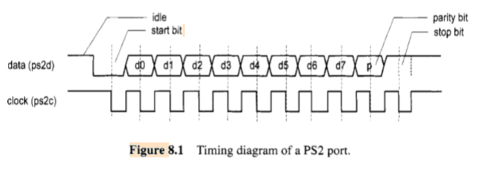
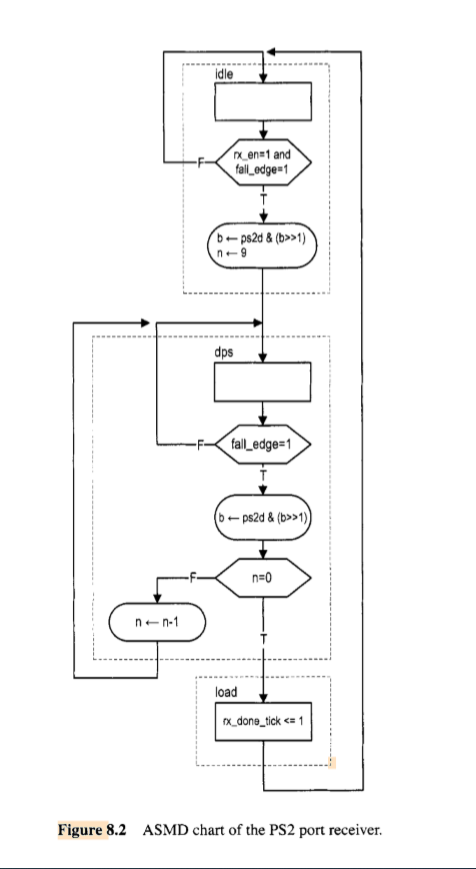

# Design Part of VHDL

## KeyBorad Implement 

### Structure 

#### Port

- 1. Data
- 2. Cloak -- T is about 60 to 100 per second ( f = 10 kHz to 16.7 kHz )
    
- 3. Vcc ( Voltage power supply ) = 5 v
- 4. Ground pin

